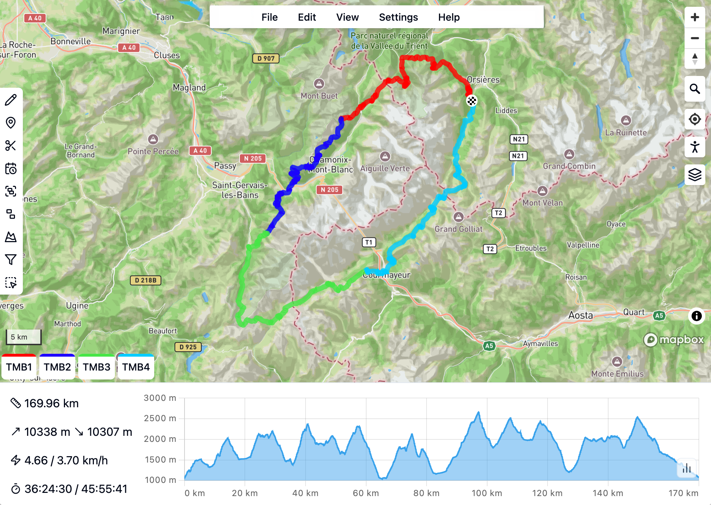

# gps.studio

[**gps.studio**](https://studio.wanderstories.space) is an online tool for creating and editing GPX files.



This repository contains the source code of the website.

## Development

The code is split into two parts:

- `gpx`: a Typescript library for parsing and manipulating GPX files,
- `website`: the website itself, which is a [SvelteKit](https://kit.svelte.dev/) application.

You will need [Node.js](https://nodejs.org/) to build and run these two parts.

### Building the `gpx` library

```bash
cd gpx
npm install
npm run build
```

### Running the website

To be able to load the map, you will need to create your own <a href="https://account.mapbox.com/auth/signup" target="_blank">Mapbox access token</a> and store it in a `.env` file in the `website` directory.

```bash
cd website
echo PUBLIC_MAPBOX_TOKEN={YOUR_MAPBOX_TOKEN} >> .env
npm install
npm run dev
```

### Delpoy with Docker

### Website

Clone the [Luen/gps.studio](https://github.com/Luen/gps.studio) GitHub repository.

```bash
git clone git@github.com:Luen/gps.studio.git
```

Create the .env file:

```bash
echo PUBLIC_MAPBOX_TOKEN={YOUR_MAPBOX_TOKEN}\nPUBLIC_MAPBOX_TOKEN_BACKUP={YOUR_BACKUP_MAPBOX_TOKEN}  >> website/.env
```

Start the Docker container:

```bash
docker compose up --build -d
```

#### BRouter

Clone the [Luen/brouter](https://github.com/gpxstudio/brouter) GitHub repository.

```bash
git clone git@github.com:gpxstudio/brouter.git
```

Build the docker image and run it with the following commands:

```bash
docker build -t brouter .
```

Download the Australian segments4 files with the following command:

```bash
wget -P misc/scripts/segments4/ https://brouter.de/brouter/segments4/E110_S10.rd5 \
    https://brouter.de/brouter/segments4/E110_S15.rd5 \
    https://brouter.de/brouter/segments4/E110_S20.rd5 \
    https://brouter.de/brouter/segments4/E110_S25.rd5 \
    https://brouter.de/brouter/segments4/E110_S30.rd5 \
    https://brouter.de/brouter/segments4/E115_S10.rd5 \
    https://brouter.de/brouter/segments4/E115_S15.rd5 \
    https://brouter.de/brouter/segments4/E115_S20.rd5 \
    https://brouter.de/brouter/segments4/E115_S25.rd5 \
    https://brouter.de/brouter/segments4/E115_S30.rd5 \
    https://brouter.de/brouter/segments4/E120_S10.rd5 \
    https://brouter.de/brouter/segments4/E120_S15.rd5 \
    https://brouter.de/brouter/segments4/E120_S20.rd5 \
    https://brouter.de/brouter/segments4/E120_S25.rd5 \
    https://brouter.de/brouter/segments4/E125_S10.rd5 \
    https://brouter.de/brouter/segments4/E125_S15.rd5 \
    https://brouter.de/brouter/segments4/E125_S20.rd5 \
    https://brouter.de/brouter/segments4/E130_S10.rd5 \
    https://brouter.de/brouter/segments4/E130_S15.rd5 \
    https://brouter.de/brouter/segments4/E130_S20.rd5 \
    https://brouter.de/brouter/segments4/E135_S10.rd5 \
    https://brouter.de/brouter/segments4/E135_S15.rd5 \
    https://brouter.de/brouter/segments4/E135_S20.rd5 \
    https://brouter.de/brouter/segments4/E140_S10.rd5 \
    https://brouter.de/brouter/segments4/E140_S15.rd5 \
    https://brouter.de/brouter/segments4/E140_S20.rd5 \
    https://brouter.de/brouter/segments4/E145_S10.rd5 \
    https://brouter.de/brouter/segments4/E145_S15.rd5 \
    https://brouter.de/brouter/segments4/E145_S20.rd5 \
    https://brouter.de/brouter/segments4/E150_S10.rd5 \
    https://brouter.de/brouter/segments4/E150_S15.rd5 \
    https://brouter.de/brouter/segments4/E150_S20.rd5
```

Start the brouter server with the following command:

```bash
docker compose up -d
```

OR

```bash
docker run --rm \
    -v ./misc/scripts/segments4:/segments4 \
    -p 17777:17777 \
    --name brouter \
    brouter
```

## Credits

Built on top of [**gpx.studio**](https://gpx.studio).
This project has been made possible thanks to the following open source projects:

- Development:
  - [Svelte](https://github.com/sveltejs/svelte) and [SvelteKit](https://github.com/sveltejs/kit) — seamless development experience
  - [MDsveX](https://github.com/pngwn/MDsveX) — allowing a Markdown-based documentation
  - [svelte-i18n](https://github.com/kaisermann/svelte-i18n) — easy localization
- Design:
  - [shadcn-svelte](https://github.com/huntabyte/shadcn-svelte) — beautiful components
  - [lucide-svelte](https://github.com/lucide-icons/lucide/tree/main/packages/lucide-svelte) — beautiful icons
  - [tailwindcss](https://github.com/tailwindlabs/tailwindcss) — easy styling
  - [Chart.js](https://github.com/chartjs/Chart.js) — beautiful and fast charts
- Logic:
  - [immer](https://github.com/immerjs/immer) — complex state management
  - [Dexie.js](https://github.com/dexie/Dexie.js) — IndexedDB wrapper
  - [fast-xml-parser](https://github.com/NaturalIntelligence/fast-xml-parser) — fast GPX file parsing
  - [SortableJS](https://github.com/SortableJS/Sortable) — creating a sortable file tree
- Mapping:
  - [Mapbox GL JS](https://github.com/mapbox/mapbox-gl-js) — beautiful and fast interactive maps
  - [brouter](https://github.com/abrensch/brouter) — routing engine
  - [OpenStreetMap](https://www.openstreetmap.org) — map data used by Mapbox and brouter
- Search:
  - [DocSearch](https://github.com/algolia/docsearch) — search engine for the documentation

## License

This project is licensed under the MIT License - see the [LICENSE](LICENSE) file for details.
